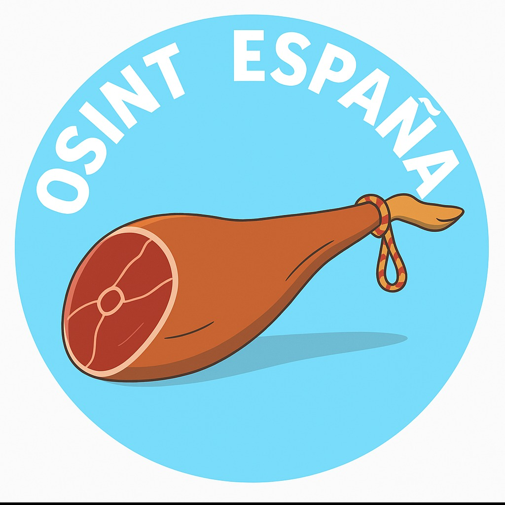

<h1 align="center">
   
  
</h1>

<h4 align="center">OSINT (Open-source intelligence)</h4>

 

# OSINT España

Repositorio creado con el objetivo de recopilar información, fuentes (sitios web/portales) y herramientas de OSINT centradas en el contexto de España.

---

## Índice

- [Prestaciones Sociales](#prestaciones-sociales)  
- [Personas Desaparecidas](#personas-desaparecidas)  
- [Procesos Judiciales](#procesos-judiciales)  
- [Consulta de Identificación (DNI/NIF)](#consulta-de-identificación-dninif)  
- [Telecomunicaciones](#telecomunicaciones)  
- [Estaciones de Radio Base (ERBs)](#estaciones-de-radio-base-erbs)  
- [Información Académica](#información-académica)  
- [Mapas y Georreferenciación](#mapas-y-georreferenciación)  
- [Salud](#salud)  
- [Motores de Búsqueda (.es)](#motores-de-búsqueda-es)  
- [Redes Sociales](#redes-sociales)  
- [Indexadores de Mensajería Instantánea](#indexadores-de-mensajería-instantánea)  
- [Conjuntos de Datos / Datos Abiertos](#conjuntos-de-datos--datos-abiertos)  
- [Remuneraciones del Poder Judicial](#remuneraciones-del-poder-judicial)  
- [Transporte Terrestre](#transporte-terrestre)  
- [Transporte Ferroviario](#transporte-ferroviario)  
- [Transporte Aéreo](#transporte-aéreo)  
- [Transporte Marítimo](#transporte-marítimo)  
- [Cámaras en Línea](#cámaras-en-línea)  
- [Otras Búsquedas Útiles](#otras-búsquedas-útiles)  
- [Dominios .es por Categoría](#dominios-es-por-categoría)  
- [Comunidades Autónomas](#comunidades-autónomas)  
- [Autores](#autores)  
- [Contribuciones](#contribuciones)  
- [Créditos](#créditos)  

---

## Prestaciones Sociales

### Seguridad Social y Subsidios  
- **Seguridad Social (Sede Electrónica)**  
  https://sede.seg-social.gob.es  
- **SEPE – Servicio Público de Empleo Estatal**  
  https://sede.sepe.gob.es  

### Prestaciones y Subvenciones  
- **Ministerio de Derechos Sociales y Agenda 2030**  
  https://www.mscbs.gob.es  
- **Ingreso Mínimo Vital**  
  https://www.seg-social.es/wps/portal/wss/internet/Trabajadores/CotizacionRecaudacionTrabajadores/36538  

---

## Personas Desaparecidas

- **Policía Nacional – Colabora: Personas desaparecidas**  
  https://www.policia.es/_es/colabora_desaparecidos.php  
- **Cruz Roja Española – Personas Desaparecidas**  
  https://www.cruzroja.es/desaparecidos  
- **Ministerio del Interior – Buscador Nacional**  
  https://www.interior.gob.es/web/servicios-al-ciudadano/desaparecidos  

---

## Procesos Judiciales

- **CENDOJ – Consulta de Sentencias**  
  http://www.poderjudicial.es/search/  
- **BOE – Boletín Oficial del Estado**  
  https://www.boe.es  
- **Sede Electrónica del Consejo General del Poder Judicial**  
  https://sede.poderjudicial.gob.es  

---

## Consulta de Identificación (DNI/NIF)

- **Sede Electrónica del Ministerio de Justicia – Certificados**  
  https://sede.mjusticia.gob.es  
- **Agencia Tributaria – Consulta de NIF/CIF**  
  https://www.agenciatributaria.es/AEAT.sede/Inicio/_Segmentos_/Empresas_y_profesionales/_Conozca_su_NIF/NIF.shtml  
- **Registro Mercantil Central – Certificados de Denominación**  
  https://www.registradores.org  

---

## Telecomunicaciones

- **CNMC – Comisión Nacional de los Mercados y la Competencia**  
  https://www.cnmc.es/  
- **Operadoras Móviles (ej. Movistar, Vodafone, Orange, MásMóvil)**  

---

## Estaciones de Radio Base (ERBs)

- **Mapa de Cobertura – CNMC**  
  https://www.cnmc.es/sites/default/files/603783_2.pdf  
- **Bases de datos públicas de ubicación de antenas** (solicitar a operadores vía transparencia)  

---

## Información Académica

- **Ministerio de Universidades**  
  https://www.universidades.gob.es  
- **Datos de Universidades y Centros**  
  https://www.educacion.gob.es/va/servicios-al-ciudadano/catalogo/general/20/servicio/Anualidad/218200  

---

## Mapas y Georreferenciación

- **Instituto Geográfico Nacional (IGN)**  
  https://www.ign.es  
- **Centro Nacional de Información Geográfica (CNIG)**  
  https://www.ign.es/web/ign/portal  
- **Catastro – Sede Electrónica**  
  https://www.sedecatastro.gob.es  

---

## Salud

- **Ministerio de Sanidad – Portal de Datos Abiertos**  
  https://www.mscbs.gob.es/profesionales/saludPublica/  
- **Información COVID-19 (archivado)**  
  https://cnecovid.isciii.es  

---

## Motores de Búsqueda (.es)

- Google España: https://www.google.es  
- Bing España: https://www.bing.com/?cc=es  
- DuckDuckGo: https://duckduckgo.com/?ka=es  
- StartPage: https://www.startpage.com/?lang=es  

---

## Redes Sociales

- Twitter: https://twitter.com  
- Facebook: https://www.facebook.com  
- Instagram: https://www.instagram.com  
- LinkedIn: https://www.linkedin.com  

---

## Indexadores de Mensajería Instantánea

- **Telegram – Búsqueda de Canales**  
  https://t.me/s/  
- **Slack Directory (comunidades públicas)**  
  https://slacklist.info  

---

## Conjuntos de Datos / Datos Abiertos

- **Datos.gob.es – Portal Nacional de Datos Abiertos**  
  https://datos.gob.es  
- **Transparencia.gob.es – Portal de Transparencia**  
  https://transparencia.gob.es  

---

## Remuneraciones del Poder Judicial

- **CGPJ – Portal de Transparencia: Remuneraciones**  
  https://www.poderjudicial.es/cgpj/es/Poder-Judicial/Transparencia/Remuneraciones/  

---

## Transporte Terrestre

- **DGT – Tráfico y Seguridad Vial**  
  https://sede.dgt.gob.es  
- **Ministerio de Transportes, Movilidad y Agenda Urbana**  
  https://www.mitma.gob.es  

---

## Transporte Ferroviario

- **ADIF – Red Ferroviaria Española**  
  http://www.adif.es  
- **Renfe – Consulta de horarios**  
  https://www.renfe.com  

---

## Transporte Aéreo

- **AENA – Aeropuertos Españoles y Navegación Aérea**  
  https://www.aena.es  

---

## Transporte Marítimo

- **Puertos del Estado**  
  http://www.puertos.es  

---

## Cámaras en Línea

- **Cámaras de Tráfico DGT (Infocar)**  
  https://infocar.dgt.es/etraffic/  

---

## Otras Búsquedas Útiles

- **INE – Instituto Nacional de Estadística**  
  https://www.ine.es  
- **Registro Central de Penados y Rebeldes**  
  https://sede.poderjudicial.gob.es  
- **BOE – Búsqueda Avanzada por Fecha y Palabras**  
  https://www.boe.es/buscar/  

---

## Dominios .es por Categoría 

| Categoría         | Sufijo         | Descripción                                                                 | Ejemplo                                |
|------------------|----------------|-----------------------------------------------------------------------------|----------------------------------------|
| **Gubernamental**| `.gob.es`      | Usado por organismos del gobierno central, ministerios y administraciones. | [www.lamoncloa.gob.es](https://www.lamoncloa.gob.es) |
| **Comercial**    | `.com.es`      | Empresas con operaciones comerciales en España.                            | www.ejemploempresa.com.es              |
| **Educativo**    | `.edu.es`      | Instituciones de enseñanza y centros educativos oficiales.                 | www.uned.edu.es                        |
| **Organizacional**| `.org.es`     | ONGs, asociaciones civiles e instituciones sin fines de lucro.             | www.asociaciondefamilias.org.es       |
| **Redes**        | `.net.es`      | Entidades relacionadas a servicios de internet y telecomunicaciones.       | www.servidor.net.es                    |
| **Informativo**  | `.info.es`     | Portales de noticias, boletines, información general.                      | www.noticiaslocales.info.es           |
| **Personal**     | `.nom.es`      | Uso individual, como blogs ou sites pessoais.                              | www.juanperez.nom.es                   |
| **Genérico**     | `.es`          | Uso general, qualquer entidade registrada na Espanha.                      | [www.rtve.es](https://www.rtve.es)     |
| **Cultural (Cataluña)** | `.cat` | Uso exclusivo para promoção da língua e cultura catalã.                    | [www.gencat.cat](https://www.gencat.cat) |

> ℹ️ Todos os domínios `.es` são gerenciados pela [Red.es](https://www.dominios.es)

---

## Comunidades Autónomas

## 🟢 Andalucía
- **BOJA - Boletín Oficial de la Junta de Andalucía**
https://www.juntadeandalucia.es/boja
- **Portal de Transparencia**
https://www.juntadeandalucia.es/transparencia
- **Datos Abiertos**
https://www.juntadeandalucia.es/datosabiertos

## 🕢 Aragón
- **BOA - Boletín Oficial de Aragón**
https://www.boa.aragon.es
- **Portal de Transparencia**
https://transparencia.aragon.es
- **Datos Abiertos**
https://opendata.aragon.es

## 🔺 Asturias
- **BOPA - Boletín Oficial del Principado de Asturias**
https://sede.asturias.es/bopa
- **Portal de Transparencia**
https://transparencia.asturias.es
- **Datos Abiertos**
https://datos.asturias.es

## 🔹 Islas Baleares
- **BOIB - Boletín Oficial**
https://www.caib.es/eboibfront/
- **Portal de Transparencia**
https://transparencia.caib.es
- **Datos Abiertos**
https://opendata.caib.es

## 🔶 Canarias
- **BOC - Boletín Oficial de Canarias**
https://www.gobiernodecanarias.org/boc/
- **Portal de Transparencia**
https://transparencia.gobiernodecanarias.org
- **Datos Abiertos**
https://datos.gobiernodecanarias.org

## 🔴 Cantabria
- **BOC - Boletín Oficial de Cantabria**
https://boc.cantabria.es
- **Portal de Transparencia**
https://transparencia.cantabria.es
- **Datos Abiertos**
https://datos.cantabria.es

## 🔳 Castilla-La Mancha
- **DOCM - Diario Oficial de Castilla-La Mancha**
https://docm.jccm.es
- **Portal de Transparencia**
https://transparencia.castillalamancha.es
- **Datos Abiertos**
https://datos.castillalamancha.es

## 🔸 Castilla y León
- **BOCYL - Boletín Oficial**
https://bocyl.jcyl.es
- **Portal de Transparencia**
https://transparencia.jcyl.es
- **Datos Abiertos**
https://datosabiertos.jcyl.es

## 🔽 Cataluña
- **DOGC - Diari Oficial de la Generalitat de Catalunya**
https://dogc.gencat.cat
- **Portal de Transparencia**
https://transparencia.gencat.cat
- **Datos Abiertos**
https://opendata.gencat.cat

## 🔱 Comunidad Valenciana
- **DOGV - Diario Oficial**
https://dogv.gva.es
- **Portal de Transparencia**
https://transparencia.gva.es
- **Datos Abiertos**
https://datosabiertos.gva.es

## 🔠 Extremadura
- **DOE - Diario Oficial de Extremadura**
https://doe.juntaex.es
- **Portal de Transparencia**
https://transparencia.juntaex.es
- **Datos Abiertos**
https://datosabiertos.juntaex.es

## 🔴 Galicia
- **DOG - Diario Oficial de Galicia**
https://www.xunta.gal/diario-oficial-galicia
- **Portal de Transparencia**
https://transparencia.xunta.gal
- **Datos Abiertos**
https://datos.xunta.gal

## 🔢 Comunidad de Madrid
- **BOCM - Boletín Oficial**
https://www.bocm.es
- **Portal de Transparencia**
https://www.comunidad.madrid/transparencia
- **Datos Abiertos**
https://datos.comunidad.madrid

## 🔡 Región de Murcia
- **BORM - Boletín Oficial**
https://www.borm.es
- **Portal de Transparencia**
https://transparencia.carm.es
- **Datos Abiertos**
https://datosabiertos.carm.es

## 🔵 Navarra
- **BON - Boletín Oficial de Navarra**
https://bon.navarra.es
- **Portal de Transparencia**
https://www.transparencia.navarra.es
- **Datos Abiertos**
https://gobiernoabierto.navarra.es/es/open-data

## 🔍 País Vasco
- **BOPV - Boletín Oficial del País Vasco**
https://www.euskadi.eus/bopv2
- **Portal de Transparencia**
https://www.euskadi.eus/transparencia
- **Datos Abiertos**
https://opendata.euskadi.eus

## 🔮 La Rioja
- **BOR - Boletín Oficial de La Rioja**
https://web.larioja.org/bor-portada
- **Portal de Transparencia**
https://www.larioja.org/transparencia
- **Datos Abiertos**
https://datos.larioja.org

## 🌟 Ceuta
- **BOCCE - Boletín Oficial de la Ciudad Autónoma de Ceuta**
https://ceuta.es/gobiernodeceuta/boletin-oficial
- **Portal de Transparencia**
https://www.ceuta.es/transparencia

## 🌍 Melilla
- **BOME - Boletín Oficial de Melilla**
https://www.melilla.es/melilla/portal.do?TR=A&IDR=1
- **Portal de Transparencia**
https://www.melilla.es/melilla/portal.do?IDM=77

---

## Autores 👔 

- [osint-espana](https://github.com/osint-espana)  

## Contribuciones ✨ 
¡Contribuciones de cualquier tipo son bienvenidas!

<!--

-->

#####  

---

## Créditos

- Inspirado en el proyecto [OSINT Brazuca](https://github.com/osintbrazuca/osint-brazuca)
